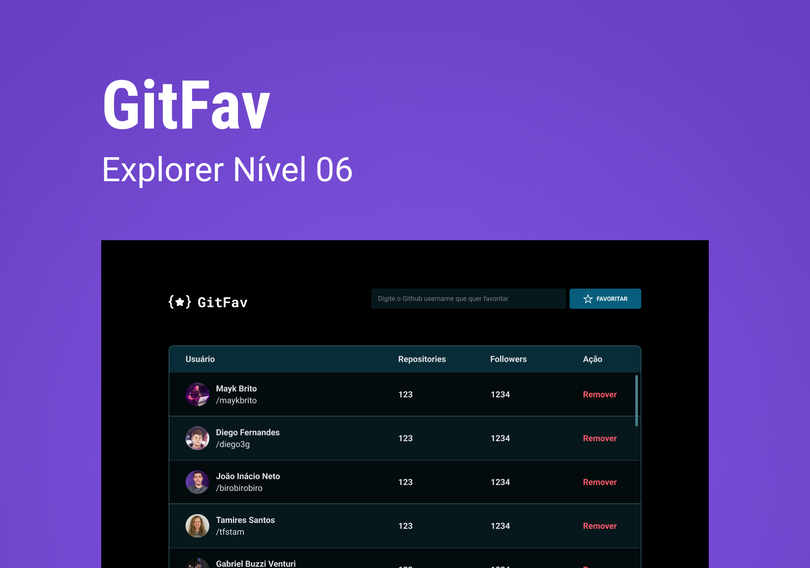

<h1 align="center"> Github User </h1>

In this challenge, you will have to recreate an application, based on a layout, to practice what you have learned so far in Stage 06. The entire table structure was built in HTML with the help of JavaScript functions to make it very dynamic.  
I followed the following instructions throughout this challenge: 

 
 
 

** FIRST CLASS JAVASCRIPT - class Favorites

- It will contain the data logic
- How the data will be structured
 
 
** SECOND CLASS JAVASCRIPT - FavoritesView

- It will create the HTML view and events
 
 
**  CLASS GITHUBUSER     - class GithubUser

- This class will be created at the beginning before these two, to structure 
Github user data that is in JSON format. 
- Then create a folder just for it and move it there. IMPORT it into the folder
Favorites.js
 
 
** Note: It is important to know that all of these classes were created with EXPORT in front so that,
If in the future, you want to use them somewhere, to know that you can export them.

## 🚀 Technologies

This project was developed with the following technologies:

- HTML e CSS
- JavaScript
- Git e Github
- Figma

## 💻 ProjeCT

Github User

## 🔖 Layout

You can view the project layout through [DESSE LINK] (https://www.figma.com/design/4RvApe69hGnKBUl6QhiCVZ/%5BDesafios-Explorer%5D-GitFav-(Copy)-(Copy)?node-id=104-48&p=f&t=aTvXP0XxdJ3HvXeB-0). It is necessary to have an account [Figma](https://figma.com) to access it.

## :memo: License

This project is under the MIT License.

---

Made with ♥ by Rocketseat :wave: [Participe da nossa comunidade!](https://discord.gg/rocketseat)

---

This project was carried out by student Kássia Almeida Moura in 2025.
# Project-12

